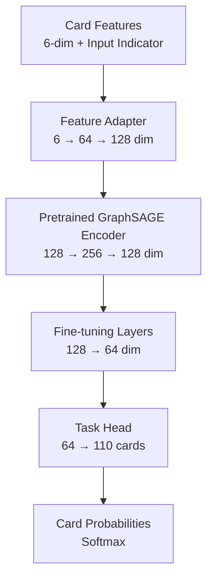

# Clash Royale Deck Recommendation System with Graph Neural Networks

A Graph Neural Network (GNN) based system that recommends cards to complete Clash Royale decks. This project leverages **transfer learning with GraphSAGE** to capture complex card synergies from professional player data, achieving improved convergence and generalization compared to training from scratch.

## Key Features

- **Graph-based representation** of card relationships using co-occurrence patterns
- **Transfer learning architecture** with staged training for improved convergence and stability
- **Staged training pipeline** (Frozen → Partial → Full Fine-tuning) for optimal performance
- **Production-ready inference** pipeline for real-time card recommendations

---

## Model Architecture

The core model is `CardRecommendationSAGEWithTransfer`, implemented in [`src/models/pretrained_sage.py`](src/models/pretrained_sage.py). This architecture combines a pretrained GraphSAGE encoder with task-specific fine-tuning layers.

### Architecture Overview



### Component Details

#### 1. Input Layer
- **Card Features (6-dim):** `id`, `elixirCost`, `rarity`, `maxLevel`, `maxEvolutionLevel`
- **Input Indicator:** Binary flag indicating if card is in the input deck (6 cards)
- **Total Input Dimension:** 7-dim per node (6 features + 1 indicator)

#### 2. Feature Adapter
Projects low-dimensional card features to the pretrained model's feature space:

```python
FeatureAdapter:
  - Linear(7 → 64) + ReLU + Dropout(0.2)
  - Linear(64 → 128) + LayerNorm
```

**Purpose:** Bridge the gap between domain-specific features (Clash Royale cards) and the pretrained encoder's expected input space.

#### 3. Pretrained GraphSAGE Encoder
Multi-layer GraphSAGE backbone that learns general graph representations:

```python
PretrainedGraphSAGEEncoder:
  - SAGEConv(128 → 256) + ReLU + Dropout(0.3)
  - SAGEConv(256 → 128) + ReLU + Dropout(0.2)
```

**GraphSAGE Advantages:**
- **Neighbor Sampling:** More scalable than GCN for large graphs
- **Learned Aggregation:** Captures heterogeneous relationships (offensive/defensive synergies)
- **Inductive:** Can generalize to new cards without full retraining

#### 4. Fine-tuning Layers
Task-specific layers that adapt the pretrained representations:

```python
Fine-tuning Layers:
  - SAGEConv(128 → 64) + ReLU + Dropout(0.1)
```

#### 5. Task Head
Final prediction layer:

```python
Task Head:
  - Linear(64 → 110) + Softmax
```

**Output:** Probability distribution over all 110 Clash Royale cards.

### Staged Training Strategy

The model uses a three-stage training approach to prevent catastrophic forgetting and ensure stable convergence:

#### Stage 1: Adapter Training (5 epochs, LR=0.01)
- **Trainable:** Feature Adapter + Task Head (~15K parameters, 9% of total)
- **Frozen:** Pretrained Encoder + Fine-tuning Layers
- **Objective:** Learn feature projection without altering pretrained representations

#### Stage 2: Partial Fine-tuning (10 epochs, LR=0.005)
- **Trainable:** Feature Adapter + Last 2 Encoder Layers + Fine-tuning Layers + Task Head (~120K parameters, 73% of total)
- **Frozen:** First Encoder Layer
- **Objective:** Adapt higher-level features while preserving low-level patterns

#### Stage 3: Full Fine-tuning (10 epochs, LR=0.001)
- **Trainable:** All layers (~164K parameters, 100% of total)
- **Objective:** Complete adaptation with very low learning rate to preserve learned knowledge

### Model Parameters

| Component | Parameters | Description |
|-----------|------------|-------------|
| Feature Adapter | ~8,000 | Projects features to pretrained space |
| Pretrained Encoder | ~98,000 | GraphSAGE backbone (128→256→128) |
| Fine-tuning Layers | ~16,000 | Task-specific adaptation |
| Task Head | ~7,000 | Final prediction layer |
| **Total** | **~164,078** | Complete model |

### Training Configuration

Training is configured in `config/config.yaml`:

```yaml
training:
  lr: 0.01  # Base learning rate
  transfer_learning:
    stage1_epochs: 5
    stage2_epochs: 10
    stage3_epochs: 10
    stage2_lr_factor: 0.5  # LR = 0.01 * 0.5 = 0.005
    stage3_lr_factor: 0.1  # LR = 0.01 * 0.1 = 0.001
```

---

## Data Pipeline

The data pipeline processes raw Clash Royale API data into a graph structure suitable for GNN training.

### Data Sources

Raw data is stored in `data/01-raw/`:
- `battle_logs.json`: Battle history from top clans (score ≥ 99,000)
- `cards.json`: Card metadata (elixir cost, rarity, levels)
- `decks.json`: Extracted deck compositions
- `clans.json`: Clan information

### Feature Engineering Pipeline

The feature engineering pipeline (`src/pipelines/feature_eng_pipeline.py`) performs the following steps:

#### 1. Graph Construction

**Nodes:**
- 110 Clash Royale cards
- Features: `id`, `elixirCost`, `rarity`, `maxLevel`, `maxEvolutionLevel`
- Normalization: Standard (zero mean, unit variance) or MinMax (0-1 range)

**Edges:**
- Co-occurrence in professional decks
- Weighted by frequency of co-occurrence
- Threshold: Minimum 5 co-occurrences to create an edge
- Undirected graph (symmetric relationships)

**Result:** ~7,232 edges connecting cards with strong synergies

#### 2. Training Example Generation

For each deck of 8 cards:
- **Input:** First 6 cards
- **Target:** Last 2 cards
- **Weight:** Based on win margin (3-crown wins weighted higher than losses)
- **Augmentation:** Also creates reverse example (last 6 → first 2)

**Weight Distribution:**
- 3-crown win: 1.0
- 2-crown win: 0.8
- 1-crown win: 0.6
- Draw: 0.0 (skipped)
- Losses: 0.05-0.2 (lower weight)

### Processing Commands

```bash
# Process raw data into graph structure
python process_features.py
```

This generates:
- `data/03-features/graph_data.json`: Graph structure (nodes, edges, features)
- `data/03-features/training_examples.json`: Training examples with weights

---

## Installation & Usage

### Prerequisites

- Python 3.11+
- PyTorch 2.6+ (with CUDA support recommended)
- PyTorch Geometric 2.7.0+
- CUDA-capable GPU (optional but recommended)

### Installation

1. **Clone the repository:**
```bash
git clone <repository-url>
cd ClashRoyalGNN
```

2. **Install dependencies:**
```bash
pip install -r requirements.txt
```

3. **Configure API token:**
```bash
cp config/config.yaml.example config/config.yaml
# Edit config/config.yaml and add your Clash Royale API token
```

### Usage

#### 1. Data Collection (Optional)

If you need to collect fresh data:

```bash
python entrypoint/collect_data.py
```

#### 2. Feature Engineering

Process raw data into graph structure:

```bash
python process_features.py
```

#### 3. Training

Train the transfer learning model:

```bash
python entrypoint/train_transfer_learning.py
```

The model will be saved to `models_transfer/best_model.pt` with training history in JSON and CSV formats.

#### 4. Inference

Generate card recommendations:

```bash
python entrypoint/inference.py \
  --cards "Hog Rider,mini PEKKA,Giant Snowball,Skeletons,Electro Spirit,Cannon" \
  --model models_transfer/best_model.pt
```

**Output:** Top 2 recommended cards with probabilities.

### Docker Support

For AMD GPUs (ROCm), use Docker:

```bash
docker-compose up
```

See `docker-compose.yml` and `Dockerfile` for configuration details.

---

## Other Models

The repository includes baseline models for comparison:

### Standard GraphSAGE

**File:** [`src/models/graphsage_model.py`](src/models/graphsage_model.py)

Baseline GraphSAGE implementation without transfer learning:
- Direct feature input (no adapter)
- Single-stage training from scratch
- Architecture: Input → GraphSAGE Layers → Output Head

**Use Case:** Baseline comparison to measure transfer learning improvements.

### GCN (Graph Convolutional Network)

**File:** [`src/models/gnn_model.py`](src/models/gnn_model.py)

Basic Graph Convolutional Network baseline:
- Simpler than GraphSAGE (no neighbor sampling)
- Uniform edge weights
- Faster training but less expressive

**Use Case:** Simplest baseline for comparison.

### Training Baseline Models

To train baseline models:

```bash
# Train GraphSAGE baseline
python entrypoint/train.py  # Uses config.yaml with gnn_type: "GraphSAGE"

# Train GCN baseline
# Edit config.yaml: gnn_type: "GCN"
python entrypoint/train.py
```

---

## Project Structure

```
ClashRoyalGNN/
├── config/
│   ├── config.yaml              # Main configuration (not in git)
│   └── config.yaml.example      # Configuration template
├── data/
│   ├── 01-raw/                  # Raw API data
│   ├── 02-preprocessed/         # Co-occurrence matrix
│   ├── 03-features/             # Graph data and training examples
│   └── 04-predictions/          # Model predictions
├── entrypoint/
│   ├── train_transfer_learning.py  # Main training script
│   ├── train.py                 # Baseline model training
│   ├── inference.py             # Inference pipeline
│   └── collect_data.py          # Data collection
├── src/
│   ├── models/
│   │   ├── pretrained_sage.py   # Transfer learning model (PRIMARY)
│   │   ├── graphsage_model.py   # Baseline GraphSAGE
│   │   └── gnn_model.py         # Baseline GCN
│   ├── pipelines/
│   │   ├── feature_eng_pipeline.py  # Graph construction
│   │   ├── training_pipeline.py     # Training utilities
│   │   └── inference_pipeline.py    # Inference utilities
│   └── utils/
│       └── card_mapper.py        # Card ID/name mapping
├── models_transfer/             # Transfer learning model outputs
├── process_features.py          # Feature engineering entry point
├── requirements.txt             # Python dependencies
└── README.md                    # This file
```

---

## Configuration

Key configuration parameters in `config/config.yaml`:

- **Training:** Learning rates, epochs per stage, batch size, early stopping
- **Model:** Architecture dimensions, dropout rates, GraphSAGE aggregation method
- **Graph:** Edge threshold, node features, normalization method
- **Data:** Directory paths, minimum clan score for filtering

See `config/config.yaml.example` for a complete template.

---

## Results

The transfer learning model achieves:
- **Validation Loss:** ~3.62 (vs ~3.35 for training from scratch)
- **Top-2 Accuracy:** ~37.3%
- **Top-5 Accuracy:** ~54.6%
- **Convergence:** Faster and more stable than baseline models

---

## License

[Add your license here]

---

## Acknowledgments

- Clash Royale API for game data
- PyTorch Geometric for GNN implementations
- Professional Clash Royale players whose deck data was used for training

