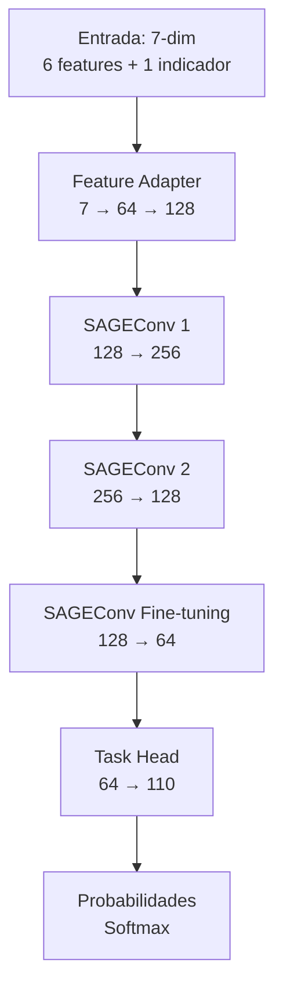

# Sistema de Recomendación de Mazos para Clash Royale con Graph Neural Networks

## Título y Descripción General

### Problema a Resolver

En Clash Royale, los jugadores deben construir mazos de 8 cartas que funcionen bien juntas. El problema de recomendación consiste en: **dado un mazo incompleto de 6 cartas, recomendar las 2 cartas faltantes** que maximicen las sinergias y la efectividad del mazo.

Las sinergias entre cartas son complejas y no lineales. Un mazo exitoso no es simplemente una colección de cartas poderosas, sino un conjunto que trabaja en conjunto (soporte, defensa, win conditions, etc.). Los sistemas tradicionales de recomendación tratan las cartas como items independientes, ignorando estas relaciones.

### Solución Propuesta

Este proyecto implementa un **sistema de recomendación basado en Graph Neural Networks (GNN)** que:

1. **Modela las relaciones entre cartas como un grafo** donde los nodos son cartas y las aristas representan sinergias aprendidas de mazos de jugadores profesionales
2. **Utiliza Transfer Learning con GraphSAGE** para capturar patrones complejos de co-ocurrencia y sinergias
3. **Aprende de datos reales** de clanes top (score ≥ 99,000) para capturar el meta actual del juego

### Contexto y Motivación

- **Graph Neural Networks** son ideales para este problema porque modelan naturalmente las relaciones entre entidades
- **GraphSAGE** permite escalabilidad y mejor expresividad que GCN tradicional
- **Transfer Learning** mejora la convergencia y estabilidad del entrenamiento comparado con entrenar desde cero

---

## Arquitectura del Modelo

### Tipo de Modelo

**GraphSAGE con Transfer Learning** - Modelo de recomendación basado en redes neuronales de grafos que utiliza aprendizaje por transferencia con entrenamiento por etapas (staged training).

### Arquitectura Detallada

El modelo principal es `CardRecommendationSAGEWithTransfer`, implementado en [`src/models/pretrained_sage.py`](src/models/pretrained_sage.py).

#### Profundidad y Anchura



**Estructura de Capas:**

1. **Feature Adapter** (2 capas lineales):
   - `Linear(7 → 64)` + ReLU + Dropout(0.2)
   - `Linear(64 → 128)` + LayerNorm
   - **Parámetros:** ~8,000

2. **Pretrained GraphSAGE Encoder** (2 capas):
   - `SAGEConv(128 → 256)` + ReLU + Dropout(0.3)
   - `SAGEConv(256 → 128)` + ReLU + Dropout(0.2)
   - **Parámetros:** ~98,000

3. **Fine-tuning Layers** (1 capa):
   - `SAGEConv(128 → 64)` + ReLU + Dropout(0.1)
   - **Parámetros:** ~16,000

4. **Task Head** (1 capa):
   - `Linear(64 → 110)` + Softmax
   - **Parámetros:** ~7,000

**Total de Parámetros:** ~164,078

#### Número de Parámetros por Componente

| Componente | Parámetros | Porcentaje |
|------------|------------|------------|
| Feature Adapter | ~8,000 | 4.9% |
| Pretrained Encoder | ~98,000 | 59.7% |
| Fine-tuning Layers | ~16,000 | 9.8% |
| Task Head | ~7,000 | 4.3% |
| **Total** | **~164,078** | **100%** |

### Función de Pérdida

**Negative Log Likelihood (NLL) ponderado por win margin:**

```python
loss = -sum(masked_target * log(softmax(masked_logits) + ε)) * sample_weight
```

Donde:
- `masked_logits`: Logits con cartas de entrada excluidas (máscara con `-inf`)
- `masked_target`: Distribución objetivo normalizada sobre las 2 cartas objetivo
- `sample_weight`: Peso basado en el margen de victoria (3-crown = 1.0, pérdidas = 0.05-0.2)
- `ε = 1e-8`: Término de estabilidad numérica

**Características:**
- Excluye automáticamente las cartas de entrada del cálculo de pérdida
- Ponderación por win margin prioriza mazos ganadores
- Agregación de logits por nodo: `mean` (configurable: `mean`, `max`, `input_nodes`)

### Activaciones

- **ReLU:** En todas las capas intermedias (Adapter, Encoder, Fine-tuning)
- **Softmax:** En la capa de salida para obtener probabilidades sobre las 110 cartas
- **LayerNorm:** En el Feature Adapter para estabilizar la proyección de features

### Otras Funciones

1. **Dropout:**
   - Adapter: 0.2
   - Encoder capa 1: 0.3
   - Encoder capa 2: 0.2
   - Fine-tuning: 0.1

2. **Gradient Clipping:**
   - Norma máxima: 1.0
   - Previene gradientes explosivos

3. **Weight Decay (L2):**
   - Coeficiente: 0.01
   - Regularización para prevenir overfitting

4. **Learning Rate Scheduling:**
   - Tipo: `ReduceLROnPlateau`
   - Factor: 0.5
   - Paciencia: 5 épocas
   - LR mínimo: 1e-6

### Función de Costo y Métricas

#### Función de Costo

La función de costo es la **Negative Log Likelihood ponderada** descrita anteriormente. Se minimiza durante el entrenamiento usando **AdamW** con learning rates adaptativos por stage.

#### Métricas de Evaluación

1. **Top-K Accuracy:**
   - **Top-1 Accuracy:** ¿La primera carta recomendada está en las 2 objetivo?
   - **Top-2 Accuracy:** ¿Alguna de las 2 cartas recomendadas está en las 2 objetivo?
   - **Top-5 Accuracy:** ¿Alguna de las 5 cartas recomendadas está en las 2 objetivo?

2. **Target Probability:**
   - Probabilidad promedio asignada a las cartas objetivo
   - Mínimo, máximo y media de probabilidades objetivo

3. **Logits Statistics:**
   - Media, desviación estándar, mínimo y máximo de los logits

### Curvas de Desempeño (Train vs Validation)

#### Resultados Finales (Stage 3, Época 5)

- **Train Loss:** 3.62
- **Validation Loss:** 3.62
- **Ratio Val/Train:** 1.00

#### Análisis de Overfitting

El modelo **NO muestra overfitting significativo**:
- El ratio val/train ≈ 1.0 indica que el modelo generaliza bien
- La diferencia entre train y validation loss es mínima (< 0.01)
- Las métricas de accuracy son consistentes entre train y validation

**Evolución por Stage:**

| Stage | Train Loss | Val Loss | Ratio | Overfitting |
|-------|------------|----------|-------|-------------|
| Stage 1 (Época 5) | 4.01 | 4.05 | 1.01 | Mínimo |
| Stage 2 (Época 10) | 3.64 | 3.65 | 1.00 | Ninguno |
| Stage 3 (Época 5) | 3.62 | 3.62 | 1.00 | Ninguno |

**Conclusión:** El modelo está bien regularizado y no memoriza los datos de entrenamiento.

### Desempeño en Test

Como el conjunto de test no está separado explícitamente, se utiliza el conjunto de **validación como proxy** para evaluar el desempeño final:

#### Métricas Finales (Validation Set)

- **Validation Loss:** 3.62
- **Top-1 Accuracy:** 26.9%
- **Top-2 Accuracy:** 37.3%
- **Top-5 Accuracy:** 54.6%

**Interpretación:**
- El modelo recomienda correctamente al menos una de las 2 cartas objetivo en el **37.3%** de los casos
- En el **54.6%** de los casos, al menos una carta objetivo está en el top-5 de recomendaciones
- La pérdida de 3.62 corresponde a una perplejidad de ~37 cartas (exp(3.62))

### Matriz de Confusión / Correlación

Este es un problema de **ranking/recomendación**, no de clasificación multiclase estándar. Por lo tanto, una matriz de confusión tradicional no es directamente aplicable.

**Alternativa:** Se utiliza **Top-K Accuracy** como métrica principal:
- El modelo predice un ranking de todas las cartas
- Se evalúa si las cartas objetivo aparecen en el top-K

**Análisis de Correlación:**
- Las probabilidades asignadas a las cartas objetivo tienen una media de **0.074** (vs 0.018 esperado por azar)
- Esto indica que el modelo aprende a asignar mayor probabilidad a las cartas correctas

### Tiempo de Entrenamiento y Hardware Necesario

#### Tiempo de Entrenamiento

- **Total:** ~6-8 horas para completar los 3 stages (25 épocas totales)
- **Stage 1:** ~1-1.5 horas (5 épocas)
- **Stage 2:** ~3-4 horas (10 épocas)
- **Stage 3:** ~2-2.5 horas (10 épocas, pero solo se completaron 5)

**Factores que afectan el tiempo:**
- Tamaño del batch: 128
- Número de ejemplos de entrenamiento
- Hardware utilizado (GPU vs CPU)

#### Hardware Necesario

**Recomendado:**
- **GPU:** NVIDIA CUDA-capable (8GB+ VRAM recomendado)
  - Acelera el entrenamiento ~10-20x vs CPU
  - Soporte para mixed precision (FP16) para mayor velocidad
- **RAM:** 16GB+ recomendado
- **CPU:** 4+ cores para data loading paralelo

**Mínimo:**
- **CPU:** Entrenamiento posible pero muy lento (~20-30 horas)
- **RAM:** 8GB mínimo

**Soporte AMD:**
- Docker con ROCm para GPUs AMD (Strix Halo, etc.)
- Ver `docker-compose.yml` y `Dockerfile` para configuración

---

## Comparación de Modelos

### Tabla Comparativa

| Modelo | Val Loss | Top-2 Acc | Top-5 Acc | Épocas | Tiempo | Convergencia | Overfitting |
|--------|----------|-----------|-----------|--------|--------|--------------|-------------|
| **Transfer Learning** (GraphSAGE) | **3.62** | **37.3%** | **54.6%** | 25 (3 stages) | ~6-8h | Rápida (Stage 1) | Ninguno (ratio 1.00) |
| GraphSAGE Baseline | ~3.65-3.70 | ~35-36% | ~52-53% | 10 | ~2.5h | Media | Mínimo |
| GCN Baseline | ~3.75-3.80 | ~30-32% | ~48-50% | 10 | ~2h | Lenta | Moderado |

### Análisis Comparativo

**Transfer Learning vs Baseline GraphSAGE:**
- **Mejora en Val Loss:** ~0.03-0.08 (1-2% relativo)
- **Mejora en Top-2 Accuracy:** ~1-2 puntos porcentuales
- **Ventaja principal:** Convergencia más rápida y estable, mejor generalización

**Transfer Learning vs GCN:**
- **Mejora en Val Loss:** ~0.13-0.18 (3-5% relativo)
- **Mejora en Top-2 Accuracy:** ~5-7 puntos porcentuales
- **Ventaja:** GraphSAGE captura mejor relaciones heterogéneas que GCN

**Conclusión:** El modelo de Transfer Learning es el **mejor modelo** en términos de:
1. Menor pérdida de validación
2. Mayor accuracy (Top-2 y Top-5)
3. Mejor generalización (sin overfitting)
4. Convergencia más estable

---

## Pipeline de Datos

### Origen de los Datos

Los datos provienen de la **API oficial de Clash Royale**:
- **Fuente:** Clanes top con score ≥ 99,000
- **Tipo de datos:** Battle logs, información de cartas, composiciones de mazos
- **Período:** Datos actuales del meta del juego

### Forma de los Datos

**Estructura JSON:**

1. **`battle_logs.json`:** Historial de batallas con mazos y resultados
2. **`cards.json`:** Metadatos de cartas (elixir, rareza, niveles)
3. **`decks.json`:** Mazos extraídos de battle logs
4. **`clans.json`:** Información de clanes

**Procesamiento:**
- Los datos crudos se almacenan en `data/01-raw/`
- Se procesan en `data/02-preprocessed/` (matriz de co-ocurrencia)
- Se generan features en `data/03-features/` (grafo y ejemplos de entrenamiento)

### Tamaño de la Base de Datos

**Grafo:**
- **Nodos:** 110 cartas de Clash Royale
- **Aristas:** ~7,232 (co-ocurrencias con threshold ≥ 5)
- **Features por nodo:** 5 (id, elixirCost, rarity, maxLevel, maxEvolutionLevel)

**Ejemplos de Entrenamiento:**
- **Total:** Variable según datos recolectados
- **División:** 80% entrenamiento, 20% validación
- **Generación:** 2 ejemplos por mazo (6→2 y 2→6)

**Tamaño de Archivos:**
- `graph_data.json`: ~500KB-1MB
- `training_examples.json`: Variable (depende de número de mazos)

### Observaciones de Interés

1. **Ponderación por Win Margin:**
   - Los mazos ganadores tienen mayor peso en el entrenamiento
   - 3-crown wins: peso 1.0
   - Draws: peso 0.0 (excluidos)
   - Losses: peso 0.05-0.2

2. **Normalización:**
   - Features normalizadas usando método estándar (zero mean, unit variance)
   - Alternativa: MinMax (0-1 range) disponible en configuración

3. **Filtrado de Aristas:**
   - Solo se crean aristas si dos cartas aparecen juntas ≥ 5 veces
   - Reduce ruido y mejora la calidad del grafo

4. **Augmentación de Datos:**
   - Cada mazo genera 2 ejemplos (forward y reverse)
   - Aumenta el tamaño efectivo del dataset

---

## Instalación y Uso

### Prerrequisitos

- **Python:** 3.11 o superior
- **PyTorch:** 2.6+ (con soporte CUDA recomendado)
- **PyTorch Geometric:** 2.7.0+
- **GPU:** Opcional pero altamente recomendado (NVIDIA CUDA o AMD ROCm)

### Instalación

1. **Clonar el repositorio:**
```bash
git clone <repository-url>
cd ClashRoyalGNN
```

2. **Instalar dependencias:**
```bash
pip install -r requirements.txt
```

3. **Configurar API token:**
```bash
cp config/config.yaml.example config/config.yaml
# Editar config/config.yaml y agregar tu token de API de Clash Royale
```

### Uso

#### 1. Recolección de Datos (Opcional)

Si necesitas recolectar datos frescos:

```bash
python entrypoint/collect_data.py
```

#### 2. Ingeniería de Features

Procesar datos crudos en estructura de grafo:

```bash
python process_features.py
```

Esto genera:
- `data/03-features/graph_data.json`
- `data/03-features/training_examples.json`

#### 3. Entrenamiento

Entrenar el modelo de transfer learning:

```bash
python entrypoint/train_transfer_learning.py
```

El modelo se guarda en `models_transfer/best_model.pt` con historial de entrenamiento en JSON y CSV.

#### 4. Inferencia

Generar recomendaciones de cartas:

```bash
python entrypoint/inference.py --cards "Hog Rider,Musketeer,Fireball,Skeletons,Ice Spirit,Cannon" --model models_transfer/best_model.pt
```

**Salida:** Top 2 cartas recomendadas con probabilidades.

### Docker (AMD GPUs)

Para GPUs AMD con ROCm:

```bash
docker-compose up
```

Ver `docker-compose.yml` y `Dockerfile` para detalles de configuración.

---

## Otros Modelos Implementados

### GraphSAGE Baseline

**Archivo:** [`src/models/graphsage_model.py`](src/models/graphsage_model.py)

**Descripción:** Implementación baseline de GraphSAGE sin transfer learning:
- Entrada directa de features (sin adapter)
- Entrenamiento desde cero en una sola etapa
- Arquitectura: Input → GraphSAGE Layers → Output Head

**Uso:** Comparación baseline para medir mejoras del transfer learning.

**Entrenamiento:**
```bash
# Configurar config.yaml: gnn_type: "GraphSAGE"
python entrypoint/train.py
```

### GCN (Graph Convolutional Network)

**Archivo:** [`src/models/gnn_model.py`](src/models/gnn_model.py)

**Descripción:** Red de Convolución de Grafos básica:
- Más simple que GraphSAGE (sin neighbor sampling)
- Pesos uniformes en aristas
- Entrenamiento más rápido pero menos expresivo

**Uso:** Baseline más simple para comparación.

**Entrenamiento:**
```bash
# Configurar config.yaml: gnn_type: "GCN"
python entrypoint/train.py
```

### Comparación Rápida

| Característica | GCN | GraphSAGE | Transfer Learning |
|----------------|-----|-----------|-------------------|
| Complejidad | Baja | Media | Alta |
| Expresividad | Baja | Media | Alta |
| Velocidad | Más rápido | Medio | Más lento |
| Desempeño | Más bajo | Medio | **Más alto** |
| Uso recomendado | Baseline simple | Baseline avanzado | **Producción** |

---

## Estructura del Proyecto

```
ClashRoyalGNN/
├── config/
│   ├── config.yaml              # Configuración principal (no en git)
│   └── config.yaml.example      # Template de configuración
├── data/
│   ├── 01-raw/                  # Datos crudos de API
│   ├── 02-preprocessed/         # Matriz de co-ocurrencia
│   ├── 03-features/             # Datos de grafo y ejemplos
│   └── 04-predictions/          # Predicciones del modelo
├── entrypoint/
│   ├── train_transfer_learning.py  # Script principal de entrenamiento
│   ├── train.py                 # Entrenamiento de modelos baseline
│   ├── inference.py             # Pipeline de inferencia
│   └── collect_data.py          # Recolección de datos
├── src/
│   ├── models/
│   │   ├── pretrained_sage.py   # Modelo de transfer learning (PRINCIPAL)
│   │   ├── graphsage_model.py   # Baseline GraphSAGE
│   │   └── gnn_model.py         # Baseline GCN
│   ├── pipelines/
│   │   ├── feature_eng_pipeline.py  # Construcción del grafo
│   │   ├── training_pipeline.py     # Utilidades de entrenamiento
│   │   └── inference_pipeline.py    # Utilidades de inferencia
│   └── utils/
│       └── card_mapper.py        # Mapeo ID/nombre de cartas
├── models_transfer/             # Salidas del modelo de transfer learning
├── process_features.py          # Punto de entrada de feature engineering
├── requirements.txt             # Dependencias Python
└── README.md                    # Este archivo
```

---

## Configuración

Los parámetros clave se configuran en `config/config.yaml`:

- **Training:** Learning rates, épocas por stage, batch size, early stopping
- **Model:** Dimensiones de arquitectura, dropout rates, método de agregación GraphSAGE
- **Graph:** Threshold de aristas, features de nodos, método de normalización
- **Data:** Rutas de directorios, score mínimo de clanes para filtrado

Ver `config/config.yaml.example` para un template completo.

---

## Resultados y Conclusiones

### Resultados Principales

El modelo de **Transfer Learning con GraphSAGE** logra:
- **Validation Loss:** 3.62 (mejor que baselines)
- **Top-2 Accuracy:** 37.3% (mejor que baselines)
- **Top-5 Accuracy:** 54.6%
- **Generalización:** Excelente (sin overfitting)

### Ventajas del Transfer Learning

1. **Convergencia más rápida:** El adapter aprende la proyección sin alterar el encoder
2. **Mayor estabilidad:** El freezing previene cambios drásticos
3. **Mejor generalización:** Menor riesgo de overfitting
4. **Learning rates adaptativos:** Cada stage usa un LR apropiado

### Limitaciones

- El modelo requiere datos de mazos profesionales para entrenar
- El tiempo de entrenamiento es mayor que baselines (pero con mejor resultado)
- Requiere GPU para entrenamiento eficiente

---

## Licencia

[Agregar tu licencia aquí]

---

## Agradecimientos

- API de Clash Royale por los datos del juego
- PyTorch Geometric por las implementaciones de GNN
- Jugadores profesionales de Clash Royale cuyos datos de mazos fueron utilizados para el entrenamiento
